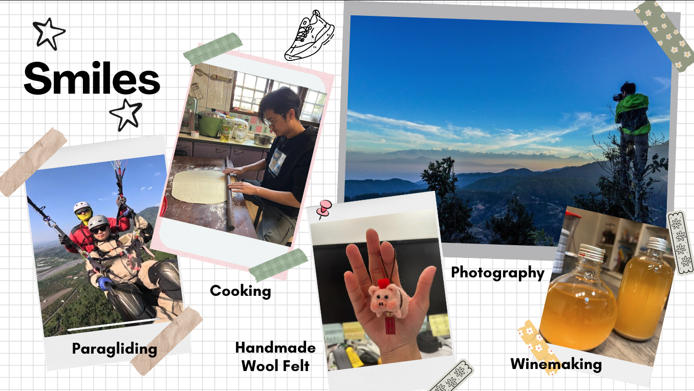

# Howard Liu

[My Personal Blog on Github](https://yuehua-liu.github.io/)
## 1. Maps

## 2. Food

## 3. Smiles

* With a curious heart. I like to learn new things. In the last year, since I've got married, I started to cook at home. It gave me a chance to learn new dishes. And I also learned how to make wool felt, my wife loved it so much.
* And recently I've tried paragliding, highlt recommended! It's an impressive experience.
* Last but not least, I'm learning winemaking, this is honey wine I made, and it tastes good!